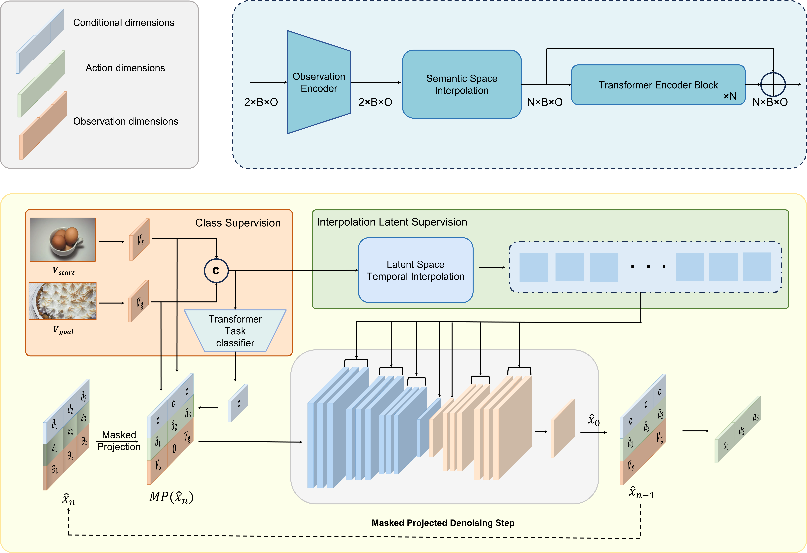

# MTID
MTID: Masked Temporal Interpolation Diffusion For Procedure Planning

<!-- This repository gives the official PyTorch implementation of [MTID: Masked Temporal Interpolation Diffusion For Procedure Planning](https://arxiv.org/abs/2303.14676v2) (CVPR 2023) -->


### Setup

------

In a conda env with cuda available, run:

```
conda env create -f environment.yaml
conda activate MTID
```


### Data Preparation

------

#### CrossTask

1. Download datasets&features

```
cd {root}/dataset/crosstask
bash download.sh
```

2. move your datasplit files and action one-hot coding file to `{root}/dataset/crosstask/crosstask_release/`

```
mv *.json crosstask_release
mv actions_one_hot.npy crosstask_release
```

#### COIN

1. Download datasets&features

```
cd {root}/dataset/coin
bash download.sh
```


#### NIV

1. Download datasets&features

```
cd {root}/dataset/NIV
bash download.sh
```


### Train

------

1. Train transformer for task category prediction wiht single GPU.

```
nohup python train_mlp.py --name=how1 --dataset=crosstask_how --gpu=0 --epochs=160 --horizon=3 > out/how1.log 2>&1 &
```

​	  Dimensions for different datasets are listed below:

| Dataset   | observation_dim      | action_dim | class_dim |
| --------- | -------------------- | ---------- | --------- |
| CrossTask | 1536(how) 9600(base) | 105        | 18        |
| COIN      | 1536                 | 778        | 180       |
| NIV       | 1536                 | 48         | 5         |

​	  The trained transformer will be saved in `{root}/save_max_mlp` and json files for training and testing data will be generated. Then run `temp.py` to generate json files with predicted task class for testing:

​	  Modify the checkpoint path(L86) and json file path(L111) in `temp.py` and run:

```
CUDA_VISIBLE_DEVICES=0 python temp.py --num_thread_reader=1 --resume --batch_size=32 --batch_size_val=32 --ckpt_path=/path
```


2. Train MTID: Modify the 'json_path_val' in `args.py` as the output file of `temp.py` and run:

```
nohup python main_distributed.py --name=your_note --gpu=1 > out/output_note.log 2>&1 &
```


​	  Training settings for different datasets are listed below:

| Dataset            | n_diffusion_steps | n_train_steps | epochs | learning-rate |
| ------------------ | ----------------- | ------------- | ------ | ------------- |
| CrossTask$_{Base}$ | 200               | 200           | 60     | 8e-4          |
| CrossTask$_{How}$  | 200               | 200           | 120    | 5e-4          |
| COIN               | 200               | 200           | 800    | 1e-5          |
| NIV                | 50                | 50            | 130    | 3e-4          |

​	  Learning-rate schedule can be adjusted in `helpers.py`. Schedule details can be found in the [supplement](https://arxiv.org/abs/2303.14676). The trained models will be saved in `{root}/save_max`.

​	  To train the $Deterministic$ and $Noise$ baselines, you need to modify `temporal.py` to remove 'time_mlp' modules and modify `diffusion.py` to change the initial noise, 'training' functions and `p_sample_loop` process.


### Inference

------

#### [Checkpoints](https://box.nju.edu.cn/d/bea511b00c984c0c8bd6/)

**Note**: Numbers may vary from runs to runs for PDPP and $Noise$ baseline, due to probalistic sampling.

##### For Metrics

​	  Modify the checkpoint path(L244) as the evaluated model in `inference.py` and run:

```
python inference.py --resume --base_model=predictor --gpu=5 --ckpt_path=/path > output.txt
```

​	  **Results** of given checkpoints:

|                         | SR    | mAcc  | MIoU  |
| ----------------------- | ----- | ----- | ----- |
| Crosstask_T=3_diffusion | 37.20 | 64.67 | 66.57 |
| COIN_T=3_diffusion      | 21.33 | 45.62 | 51.82 |
| NIV_T=3_diffusion       | 30.20 | 48.45 | 57.28 |


##### For probabilistic modeling

​	  To evaluate the $Deterministic$ and $Noise$ baselines, you need to modify `temporal.py` to remove 'time_mlp' modules and modify `diffusion.py` to change the initial noise and `p_sample_loop` process. For $Deterministic$ baseline, `num_sampling`(L26) in `uncertain.py` should be 1.

​	  Modify the checkpoint path(L309) as the evaluated model in `uncertain.py` and run:

```
CUDA_VISIBLE_DEVICES=0 python uncertain.py --multiprocessing-distributed --num_thread_reader=1 --cudnn_benchmark=1 --pin_memory --checkpoint_dir=whl --resume --batch_size=32 --batch_size_val=32 --evaluate > output.txt
```

​	  **Results** of given checkpoints:

|                         | NLL  | KL-Div | ModePrec | ModeRec |
| ----------------------- | ---- | ------ | -------- | ------- |
| Crosstask_T=6_diffusion | 4.06 | 2.76   | 25.61    | 22.68   |
| Crosstask_T=6_noise     | 4.79 | 3.49   | 24.51    | 11.04   |
| Crosstask_T=6_zero      | 5.12 | 3.82   | 25.24    | 6.75    |


### Citation

------

<!-- If this project helps you in your research or project, please cite our paper: -->

```
<!-- @inproceedings{wang2023PDPPprojected,
      title={PDPP:Projected Diffusion for Procedure Planning in Instructional Videos}, 
      author={Hanlin Wang and Yilu Wu and Sheng Guo and Limin Wang},
      booktitle={{CVPR}},
      year={2023}
} -->
```


### Acknowledgements

------

<!-- We would like to thank [He Zhao](https://joehezhao.github.io/) for his help in extracting the s3d features and providing the evaluation code of probabilistic modeling in [P3IV](https://github.com/JoeHEZHAO/procedure-planing). The diffusion model implementation is based on [diffuser](https://github.com/jannerm/diffuser) and [improved-diffusion](https://github.com/openai/improved-diffusion). We also reference and use some code from [PlaTe](https://github.com/Jiankai-Sun/plate-pytorch). Very sincere thanks to the contributors to these excellent codebases. -->
