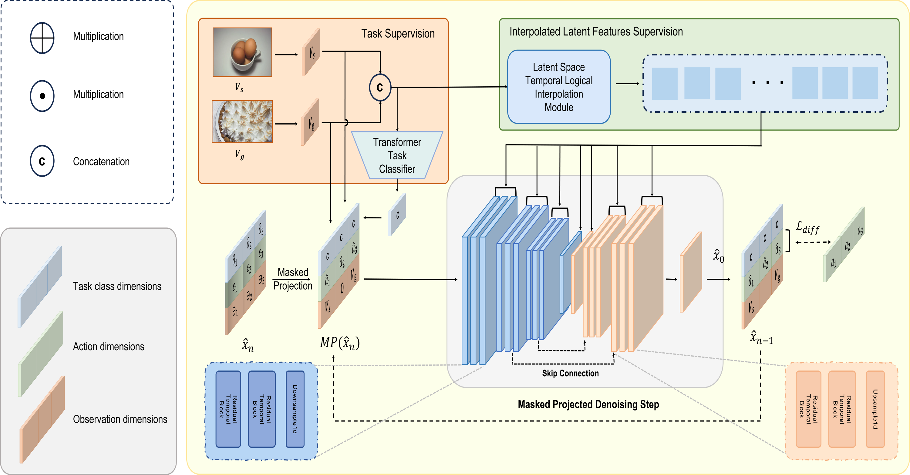

# MTID: Masked Temporal Interpolation Diffusion For Procedure Planning

<div align="center">

[](https://openreview.net/forum?id=HnpDHiItd2)
[](https://yuankjing.github.io/MTID-Project-Page/)

</div>

> #### [**MTID**: Masked Temporal Interpolation Diffusion For Procedure Planning]()
>
> ##### [Yufan Zhou](https://wiserzhou.github.io/), [Zhaobo Qi](https://scholar.google.com.hk/citations?user=QZ8URKAAAAAJ&hl=zh-CN), [Lingshuai Lin](https://github.com/lls2003), [Junqi Jing](https://github.com), [Tingting Chai](https://github.com), [Beichen Zhang](https://github.com), [Shuhui Wang](https://github.com), [Weigang Zhang](https://github.com)

## Paper Teaser
<!-- Teaser Image -->
<div align="center" style="margin-top: 15px; width: 100%; max-width: 100%; position: relative;">
  
</div>

<div align="left" style="margin-top: 15px;">
  <p style="font-size: 12px; font-weight: 500; color: #444;">
   We propose the Masked Temporal Interpolation Diffusion (<strong>MTID</strong>) model for procedure planning in instructional videos. The core concept is utilizing intermediate latent visual features, generated by a latent space temporal interpolation module, to provide comprehensive visual information for mid-state supervision. These generated visual features are directly fed into the action reasoning model, ensuring effective application of intermediate supervision to the current action reasoning task through end-to-end training.
  </p>
</div>

### Environment Setup

------

In a conda env with cuda available, run:

```
conda create --name MTID python==3.10
conda activate MTID
pip install -r requirements.txt
```

### Data Preparation

------

#### CrossTask&COIN&NIV

1. Download datasets&features

```
cd ./dataset/{dataset_name}
bash download.sh
```

dataset_name = crosstask, coin, NIV

Or you can find the datasets from the [huggingface](https://huggingface.co/datasets/WiserZhou/ProcedurePlanning/tree/main).

### Train

------

1. Train transformer for task category prediction wiht single GPU.

```
python train_mlp.py --name=traim_mlp_test --dataset=crosstask_how --gpu=0 --horizon=3
```

​   The trained transformer will be saved in `./save_max_mlp` and json files for training and testing data will be generated. Then run `temp.py` to generate json files with predicted task class for testing:

​   Then run `temp.py` :

```
python temp.py --num_thread_reader=1 --resume --batch_size=32 --gpu=0 --batch_size_val=32 --ckpt_path=/path
```

2. Train MTID: Move the file generated by `temp.py` to the specified location in `dataset/environments_config.json` and run:

```
python main_distributed.py --dataset=crosstask_how --name=main_test --gpu=0 --base_model=predictor --horizon=3
```

​   To train the $Deterministic$ and $Noise$ baselines, you need to modify `temporalPredictor.py` to remove 'time_mlp' modules and modify `diffusion.py` to change the initial noise, 'training' functions and `p_sample_loop` process.

### Inference

------

**Note**: Numbers may vary from runs to runs for PDPP and $Noise$ baseline, due to probalistic sampling.

##### For Metrics

All results have been printed to the `log` files in the `out` folder. If you want to perform inference separately, you can use the following command:

```
python inference.py --resume --base_model=predictor --gpu=0 --ckpt_path=/path
```

##### For probabilistic modeling

​   To evaluate the $Deterministic$ and $Noise$ baselines, you need to modify `temporalPredictor.py` to remove 'time_mlp' modules and modify `diffusion.py` to change the initial noise and `p_sample_loop` process. For $Deterministic$ baseline, `num_sampling`(L26) in `uncertain.py` should be 1.

​   Modify the checkpoint path(L348) as the evaluated model in `uncertain.py` and run:

```
nohup python uncertain.py --gpu=1 --num_thread_reader=1 --cudnn_benchmark=1 --pin_memory --base_model=predictor --resume --batch_size=32 --batch_size_val=32 --evaluate > out/result.log 2>&1 &
```

### Citation

------

<!-- If this project helps you in your research or project, please cite our paper: -->

```
@inproceedings{
  zhou2025masked,
  title={Masked Temporal Interpolation Diffusion for Procedure Planning in Instructional Videos},
  author={Yufan Zhou and Zhaobo Qi and Lingshuai Lin and Junqi Jing and Tingting Chai and Beichen Zhang and Shuhui Wang and Weigang Zhang},
  booktitle={ICLR},
  year={2025},
}
```

## Acknowledgement

We appreciate the authors of [PDPP](https://github.com/MCG-NJU/PDPP), [diffusers](https://github.com/huggingface/diffusers) to share their code.
