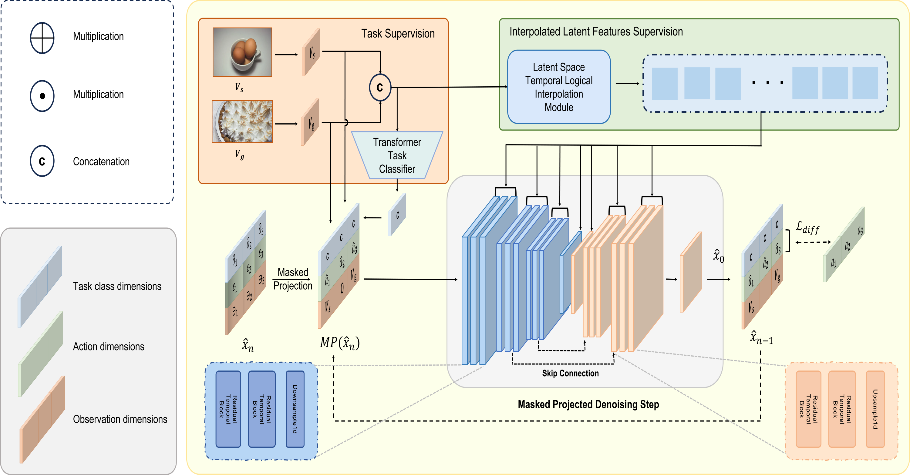

# MTID
MTID: Masked Temporal Interpolation Diffusion For Procedure Planning

<!-- This repository gives the official PyTorch implementation of [MTID: Masked Temporal Interpolation Diffusion For Procedure Planning](https://arxiv.org/abs/2303.14676v2) (CVPR 2023) -->
<details>
<summary>Overall Architecture Diagram (click to expand)</summary>


</details>

<details>
<summary>Latent Space Temporal Logical Interpolation Module (click to expand)</summary>


</details>

<details>
<summary>Residal Temporal Blocks (click to expand)</summary>


</details>


## Overview

Our masked temporal interpolation diffusion (prediction horizon $T=3$) works as follows:

1. Train a transformer task classifier to generate condition information $c$, used as guidance along with observations $V_s$ and $V_g$.

2. Input concatenated observations into latent space temporal interpolation module to obtain latent temporal and logic supervision.

3. Compute denoising process iteratively:
   - Conduct masked projection on input
   - Predict initial distribution using learned model $f(\theta)$
   - Calculate $\hat{x}_{n-1}$ with U-Net output $\hat{x}_0$

4. After $N$ denoising steps, select action dimensions as final result.

### Setup

------

In a conda env with cuda available, run:

```
conda create --name MTID python=3.10
conda activate MTID
pip install -r requirements.txt
```
or

```
conda env create -f environment.yaml
conda activate MTID
```


### Data Preparation

------

#### CrossTask

1. Download datasets&features

```
cd {root}/dataset/crosstask
bash download.sh
```

2. move your datasplit files and action one-hot coding file to `{root}/dataset/crosstask/crosstask_release/`

```
mv *.json crosstask_release
mv actions_one_hot.npy crosstask_release
```

#### COIN

1. Download datasets&features

```
cd {root}/dataset/coin
bash download.sh
```


#### NIV

1. Download datasets&features

```
cd {root}/dataset/NIV
bash download.sh
```


### Train

------

1. Train transformer for task category prediction wiht single GPU.

```
nohup python train_mlp.py --name=how1 --dataset=crosstask_how --gpu=0 --epochs=160 --horizon=3 > out/how1.log 2>&1 &
```

​	  Dimensions for different datasets are listed below:

| Dataset   | observation_dim      | action_dim | class_dim |
| --------- | -------------------- | ---------- | --------- |
| CrossTask | 1536(how)            | 105        | 18        |
| COIN      | 1536                 | 778        | 180       |
| NIV       | 1536                 | 48         | 5         |

​	  The trained transformer will be saved in `{root}/save_max_mlp` and json files for training and testing data will be generated. Then run `temp.py` to generate json files with predicted task class for testing:

​	  Modify the checkpoint path(L86) and json file path(L111) in `temp.py` and run:

```
CUDA_VISIBLE_DEVICES=0 python temp.py --num_thread_reader=1 --resume --batch_size=32 --batch_size_val=32 --ckpt_path=/path
```


2. Train MTID: Modify the 'json_path_val**i**' in `dataset/environments_config.json` as the output file of `temp.py` and run:

```
nohup python main_distributed.py --dataset=crosstask_how --name=how1 --gpu=0 --base_model=predictor --horizon=3 > out/how1.log 2>&1 &
```

​	  To train the $Deterministic$ and $Noise$ baselines, you need to modify `temporal.py` to remove 'time_mlp' modules and modify `diffusion.py` to change the initial noise, 'training' functions and `p_sample_loop` process.


### Inference

------

**Note**: Numbers may vary from runs to runs for PDPP and $Noise$ baseline, due to probalistic sampling.

##### For Metrics

All results have been printed to the `log` files in the `out` folder. If you want to perform inference separately, you can use the following command:
```
python inference.py --resume --base_model=predictor --gpu=0 --ckpt_path=/path > output.txt
```


##### For probabilistic modeling

​	  To evaluate the $Deterministic$ and $Noise$ baselines, you need to modify `temporal.py` to remove 'time_mlp' modules and modify `diffusion.py` to change the initial noise and `p_sample_loop` process. For $Deterministic$ baseline, `num_sampling`(L26) in `uncertain.py` should be 1.

​	  Modify the checkpoint path(L309) as the evaluated model in `uncertain.py` and run:

```
CUDA_VISIBLE_DEVICES=0 python uncertain.py --multiprocessing-distributed --num_thread_reader=1 --cudnn_benchmark=1 --pin_memory --checkpoint_dir=whl --resume --batch_size=32 --batch_size_val=32 --evaluate > output.txt
```


### Citation

------

<!-- If this project helps you in your research or project, please cite our paper: -->

```

```
